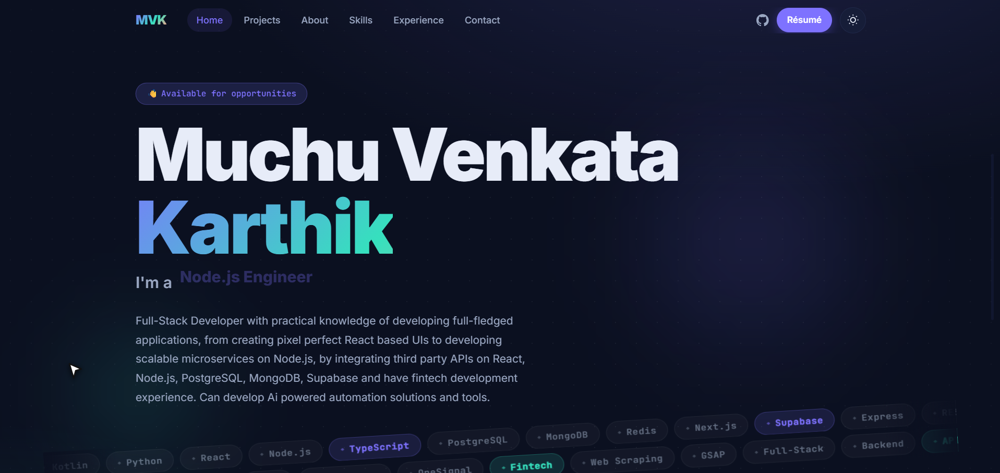

<div align="center">

# 🚀 Venkata Karthik - Portfolio

**Full-Stack & Backend Engineer · TypeScript · Node.js · React · PostgreSQL · MongoDB · Redis**

[](https://muchukarthik.stackinfi.in)
[](https://linkedin.com/in/venkatakarthikm)
[](https://github.com/venkatakarthikm)
[](mailto:2200030154cseh@gmail.com)

---



</div>

---

## ✨ About the Portfolio

This is my personal portfolio - a production-quality, fully animated, dual-theme (light + dark) single-page application that showcases my projects, skills, experience, and GitHub activity.

Built to **Lighthouse 95+** standards across Performance, Accessibility, Best Practices, and SEO.

### What makes it different
- 🎭 **Dual theme** - smooth animated light ↔ dark swap (no flash on reload)
- 🎯 **GSAP-powered motion** - typewriter hero, scroll-triggered reveals, pinned horizontal timeline, counter-up stats, SVG path-draw
- ♿ **WCAG AA accessible** - keyboard nav, focus rings, skip-link, reduced-motion support
- 🤖 **AI/LLM discoverable** - `llms.txt`, `llms-full.txt`, `ai.txt`, `tdmrep.json`, JSON-LD `Person` schema
- 🚀 **Performance optimised** - lazy iframes (only on hover), lazy images, code-split bundles

---

## 🛠 Tech Stack

| Category | Technology |
|---|---|
| **Build** |  |
| **Framework** |  |
| **Styling** |  + CSS Custom Properties |
| **Animation** |  + Lenis |
| **Language** | JavaScript (ES2024) |
| **Deployment** | Stackinfi (muchukarthik.stackinfi.in) |

---

## 📋 Featured Projects

| # | Project | Description | Stack | Live |
|---|---|---|---|---|
| 1 | **TrackWicket** | Real-time cricket tracking with custom scrapers | React · REST · WebSockets · OneSignal | [🔗](https://trackwicket.tech/) |
| 2 | **API Coolie** | API scheduler + code-execution platform · 40+ endpoints | React · Node.js · MongoDB · Redis · OpenRouter | [🔗](https://apicoolie.stackinfi.in/) |
| 3 | **Fourzdeals** | Full-stack MERN e-commerce with role auth + payments | MERN · Payment Gateway · Role Auth | [🔗](https://fourzdeals.netlify.app/) |
| 4 | **selftaughtstack** | Developer learning resource hub | Web | [🔗](https://selftaughtstack.onrender.com/) |
| 5 | **stackinfi** | Multi-product developer platform (Cloudflare DNS) | Platform · Cloudflare | [🔗](https://stackinfi.in/) |
| 6 | **ChatVK** | Real-time chat + WebRTC video calling | MERN · WebSockets · WebRTC | [🔗](https://chatwebvk.onrender.com) |
| 7 | **Weather Flow** | Live geolocation weather with animated UI | React · GeoLocation · OpenWeather | [🔗](https://weatherflow.onrender.com) |

---

## 📂 Project Structure

```
portfolio/
├── public/
│   ├── llms.txt                  ← LLM discovery (concise)
│   ├── llms-full.txt             ← LLM discovery (full content)
│   ├── sitemap.xml               ← XML sitemap
│   ├── robots.txt
│   ├── manifest.webmanifest      ← PWA manifest
│   ├── humans.txt
│   ├── og/                       ← OG images (1200×630)
│   ├── projects/                 ← Project poster WebPs
│   └── .well-known/
│       ├── security.txt
│       ├── ai.txt                ← AI crawler permissions
│       └── tdmrep.json           ← TDM rights (EU copyright)
├── src/
│   ├── data/
│   │   ├── profile.js            ← Summaries, contact, stats, skills
│   │   └── projects.js           ← All 18 projects with full schema
│   ├── components/
│   │   ├── Nav.jsx               ← Sticky nav + theme toggle
│   │   ├── Hero.jsx              ← Animated hero + typewriter
│   │   ├── SpotlightGrid.jsx     ← 7 featured projects
│   │   ├── ProjectTile.jsx       ← Tile with live iframe on hover
│   │   ├── SecondaryGrid.jsx     ← 11 secondary projects + filters
│   │   ├── About.jsx             ← Bio + counter-up stats
│   │   ├── SkillsCloud.jsx       ← Skill map + tooltips
│   │   ├── GithubActivity.jsx    ← Live GitHub stats widgets
│   │   ├── ExperienceTimeline.jsx← Pinned horizontal timeline
│   │   ├── Beyond.jsx            ← Beyond-web-apps section
│   │   ├── Contact.jsx           ← Email + social + résumé
│   │   └── Footer.jsx
│   ├── hooks/
│   │   ├── useTheme.js           ← Theme hook (localStorage + system)
│   │   └── useReducedMotion.js
│   ├── motion/
│   │   └── gsapConfig.js         ← GSAP setup + Lenis + utilities
│   └── styles/
│       ├── tokens.css            ← All design tokens (light + dark)
│       └── tailwind.css
├── index.html                    ← FOUC-prevention + JSON-LD + meta
├── vite.config.js
├── AGENTS.md                     ← AI coding agent instructions
└── README.md
```

---

## 🚀 Getting Started

### Prerequisites
- Node.js ≥ 18
- npm ≥ 9

### Installation

```bash
# Clone the repository
git clone https://github.com/venkatakarthikm/portfolio.git
cd portfolio

# Install dependencies
npm install

# Start development server
npm run dev
# → Open http://localhost:5173
```

### Build for production

```bash
npm run build
# Output in dist/

npm run preview
# Preview the production build locally
```

---

## 🎨 Design System

### Color Tokens

| Token | Light | Dark | Usage |
|---|---|---|---|
| `--bg-base` | `#FAFAF7` (warm paper) | `#0B1020` (deep navy) | Page background |
| `--accent-1` | `#6D5BFF` (electric indigo) | `#7E72FF` | CTAs, links |
| `--accent-2` | `#16C9A7` (mint) | `#36E0BE` | Secondary highlights |
| `--accent-3` | `#D4622A` (coral) | `#FFA089` | Badges, spotlight |

### Motion Principles
- **Lenis** for physics-accurate smooth scrolling
- **GSAP ScrollTrigger** for scroll-linked animations
- All animations respect `prefers-reduced-motion: reduce`
- Theme transitions: 450ms `cubic-bezier(.2,.8,.2,1)`

---

## 🔍 SEO & AI Discoverability

| File | Purpose |
|---|---|
| `/llms.txt` | LLM-readable site index (llmstxt.org format) |
| `/llms-full.txt` | Full content bundle for AI ingestion |
| `/sitemap.xml` | XML sitemap for search crawlers |
| `/robots.txt` | Crawler permissions |
| `/manifest.webmanifest` | PWA manifest |
| `/.well-known/ai.txt` | AI crawler permissions |
| `/.well-known/tdmrep.json` | TDM rights reservation (EU Copyright Directive) |
| `index.html` | JSON-LD `Person` schema + OG/Twitter meta |

---

## 📊 GitHub Stats

<div align="center">

[](https://github.com/venkatakarthikm)

[](https://github.com/venkatakarthikm)

</div>

---

## 🤝 Contributing / Contact

Found a bug or want to suggest something?

- **Email:** [2200030154cseh@gmail.com](mailto:2200030154cseh@gmail.com?subject=Hello%20from%20your%20portfolio)
- **LinkedIn:** [venkatakarthikm](https://linkedin.com/in/venkatakarthikm)
- **GitHub Issues:** Open an issue on this repo

---

## 📄 License

© 2026 Muchu Venkata Karthik. All rights reserved.

The portfolio design and content are personal intellectual property. The code structure may be used as a reference for learning purposes.

---

<div align="center">

**Built with care by [Muchu Venkata Karthik](https://muchukarthik.stackinfi.in) · Powered by React + GSAP + Vite**

*No tracking without consent.*

</div>
